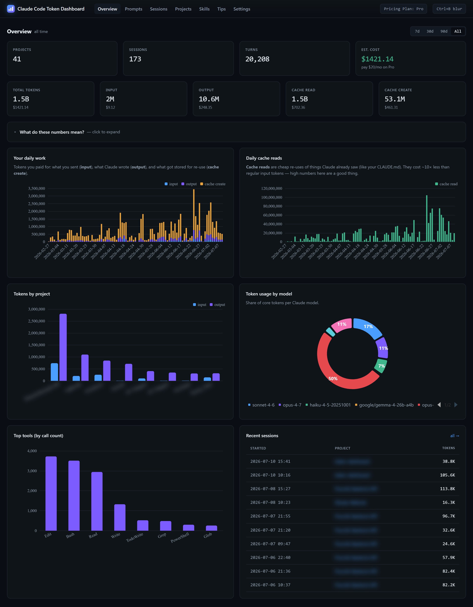
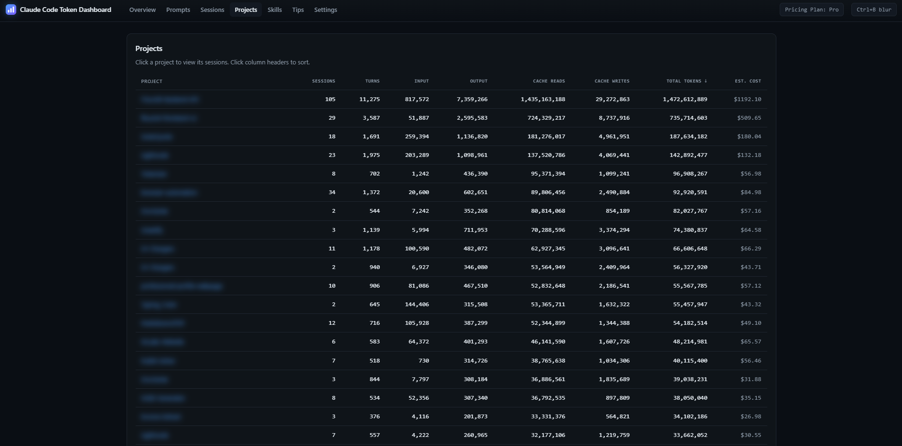
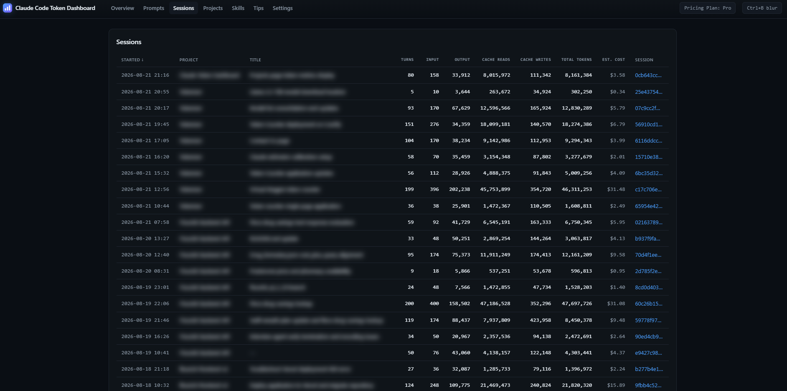

# Claude Code Token Dashboard

A local dashboard that reads the JSONL transcripts Claude Code writes to `~/.claude/projects/` and turns them into per-prompt cost analytics, tool/file heatmaps, subagent attribution, cache analytics, project comparisons, and a rule-based tips engine.

**Everything runs locally.** No data leaves your machine — no telemetry, no API calls for your data, no login.



## What this is useful for

- Seeing which of your prompts are expensive (surprise: they usually involve large tool results).
- Comparing token usage across projects you've worked on — click any project to drill into its sessions.
- Spotting wasteful patterns — the same file read twenty times in a session, a tool call returning 80k tokens.
- Understanding what a "cache hit" actually saves you.
- If you're on Pro or Max, confirming you're getting your money's worth in API-equivalent dollars.

## Prerequisites

- **Python 3.8 or newer** — already installed on macOS and most Linux. On Windows: `winget install Python.Python.3.12` or download from python.org.
- **Claude Code** — installed and with at least one session run. The dashboard reads those sessions. If you just installed Claude Code and haven't used it yet, run at least one prompt first.
- **A web browser.** Any modern one.

No `pip install`. No Node.js. No build step.

## Quickstart

```bash
git clone https://github.com/nateherkai/token-dashboard.git
cd token-dashboard
python cli.py dashboard
```

> On Windows, if `python3` isn't on your PATH, substitute `py -3` for `python3` in every command below. You can also double-click [`start_dashboard.bat`](start_dashboard.bat) to launch the dashboard without opening a terminal.

The command:
1. Scans `~/.claude/projects/` (first run can take 20–60 seconds on a heavy user's machine).
2. Starts a local server at http://127.0.0.1:8080.
3. Opens your default browser to that URL.

Leave it running; it re-scans every 30 seconds and pushes updates live. Stop with `Ctrl+C`.

## Where the data comes from

Claude Code writes one JSONL file per session here:

| OS | Path |
|---|---|
| macOS / Linux | `~/.claude/projects/<project-slug>/<session-id>.jsonl` |
| Windows | `C:\Users\<you>\.claude\projects\<project-slug>\<session-id>.jsonl` |

The dashboard never modifies those files — it only reads them and keeps a local SQLite cache at `~/.claude/token-dashboard.db`.

To point at a different location:

```bash
python3 cli.py dashboard --projects-dir /path/to/projects --db /path/to/cache.db
```

### Environment variables

| Var | Default | Purpose |
|---|---|---|
| `PORT` | `8080` | Port the local web server listens on |
| `HOST` | `127.0.0.1` | Bind address. Keep the default. Setting `0.0.0.0` exposes your entire prompt history to anyone on your local network — don't do this on any network you don't fully control (no coffee-shop Wi-Fi, no coworking spaces). |
| `CLAUDE_PROJECTS_DIR` | `~/.claude/projects` | Where to scan for session JSONL files |
| `TOKEN_DASHBOARD_DB` | `~/.claude/token-dashboard.db` | SQLite cache location |

Pricing lives in [`pricing.json`](pricing.json). Edit it directly if model prices change or to add a new plan. Current rates are sourced from the [Anthropic pricing page](https://platform.claude.com/docs/en/about-claude/pricing).

## CLI reference

```bash
python3 cli.py scan          # populate / refresh the local DB, then exit
python3 cli.py today         # today's totals (terminal)
python3 cli.py stats         # all-time totals (terminal)
python3 cli.py tips          # active suggestions (terminal)
python3 cli.py dashboard     # scan + serve the UI at http://localhost:8080

# dashboard flags
python3 cli.py dashboard --no-open   # don't auto-open the browser
python3 cli.py dashboard --no-scan   # skip the initial scan (use cached DB only)
```

Change the port: `PORT=9000 python3 cli.py dashboard`.

### Daily background scan (Windows)

If you only open the dashboard occasionally, the startup scan has a lot of new transcript data to catch up on. A scheduled task can scan once a day instead, so the dashboard starts quickly:

```powershell
powershell -ExecutionPolicy Bypass -File scripts\install_daily_scan.ps1             # daily at 13:00
powershell -ExecutionPolicy Bypass -File scripts\install_daily_scan.ps1 -At 09:30   # custom time
powershell -ExecutionPolicy Bypass -File scripts\install_daily_scan.ps1 -Uninstall
```

The task runs `scripts/daily_scan.py` with `pythonw` (no console window) as your user. If the PC is off at the scheduled time, it runs once you're back. Results go to `~/.claude/token-dashboard-scan.log`. On macOS/Linux, use a cron entry instead: `0 13 * * * python3 /path/to/scripts/daily_scan.py`.

## The 7 tabs

The dashboard is a single page with a hash-router tab bar across the top. Each tab is backed by its own JSON API under `/api/`:

- **Overview** — KPI cards for total projects, sessions, turns, estimated cost, and all token categories (input / output / cache read / cache create). Each token card also shows its own estimated cost, so you can see at a glance where your spend concentrates. Daily work and cache-read charts, tokens-by-project, token share by model, top tools by call count, and recent sessions. Supports 7d / 30d / 90d / All time ranges. This is the landing tab.
- **Prompts** — user prompts filterable by date range (7d / 30d / 90d / All, default All; the range is shared with the Overview tab) and sortable by most tokens or most recent. Click any row to expand the full prompt text, token details, and a link to the originating session.
- **Sessions** — list of sessions with sortable columns (started, turns, tokens, estimated cost). Click a session ID to open the turn-by-turn detail view, where every turn shows its local timestamp, model, token counts, and a clickable prompt/tools cell that expands to the full text in a modal.
- **Projects** — per-project comparison with sortable columns (sessions, turns, core tokens, estimated cost). Click any project name to open a dedicated project page: a KPI summary (total sessions, turns, core tokens, cache reads, and estimated cost) above all its sessions, each showing started/ended times, turns, tokens, and estimated cost. Each session links directly to its turn-by-turn detail view.
- **Skills** — which skills you invoke most often, and (where we can measure them) their token cost. See [limitations](docs/KNOWN_LIMITATIONS.md#skills-token-counts-are-partial).
- **Tips** — rule-based suggestions for reducing token usage (repeated file reads, oversized tool results, low cache-hit rate, etc.).
- **Settings** — switch pricing between API / Pro / Max / Max-20x so cost figures everywhere else reflect your actual plan.

The Overview tab also has a built-in "What do these numbers mean?" panel that explains input/output/cache tokens in plain English.





### Privacy controls

Press **Cmd+B** (macOS) or **Ctrl+B** (Windows/Linux) on any tab to blur all prompt text and project names — useful when sharing your screen. On the Overview "Tokens by project" chart this blurs only the project-name labels, leaving the bars and axes readable.

## Troubleshooting

**"No data" or empty charts.** Run `python3 cli.py scan` once to populate the DB, then reload.

**Port 8080 already in use.** `PORT=9000 python3 cli.py dashboard`.

**Numbers look wrong / stuck.** The DB lives at `~/.claude/token-dashboard.db`. Delete it and re-run `python3 cli.py scan` to rebuild from scratch.

**Running the dashboard twice at the same time.** Don't — both processes will fight over the SQLite DB. Stop all instances before starting a new one.

## Accuracy note

Claude Code writes each assistant response 2–3 times to disk while it streams (the same API message gets snapshotted as output grows). The dashboard dedupes these by `message.id` so the final tally matches what the API actually billed. If you compare against another tool that sums every JSONL row, expect this dashboard's numbers to be lower — and closer to reality.

## Privacy

Nothing leaves your machine. No telemetry. No remote calls for your data. The browser fetches its JSON from `127.0.0.1`, and all JS/CSS/fonts are served from that same local server — ECharts is vendored into `web/`, and the UI falls back to system fonts rather than pulling from a font CDN. If you want to verify: `grep -r "https://" token_dashboard/ web/` — you'll find nothing.

## Tech stack

Python 3 (stdlib only) for the CLI, scanner, and HTTP server. SQLite for the local cache. Vanilla JS + ECharts for the UI, no build step. Dark theme, hash-based router, server-sent events for live refresh.

Data flow: `cli.py` → `token_dashboard/scanner.py` → SQLite DB; `token_dashboard/server.py` exposes `/api/*` JSON routes and serves `web/`.

## Further reading

- [`CLAUDE.md`](CLAUDE.md) — conventions and architecture overview (also picked up automatically by Claude Code)
- [`CONTRIBUTING.md`](CONTRIBUTING.md) — how to develop and test
- [`docs/KNOWN_LIMITATIONS.md`](docs/KNOWN_LIMITATIONS.md) — rough edges
- [`docs/inspiration.md`](docs/inspiration.md) — prior art and how this project diverges

## Contributing

See [`CONTRIBUTING.md`](CONTRIBUTING.md). Short version: fork, `python3 -m unittest discover tests` before opening a PR, keep it stdlib-only.

## Credits

This project is a fork of [nateherkai/token-dashboard](https://github.com/nateherkai/token-dashboard), extended with following features:

- In Projects section, added the support of sortable columns and clicking on project opens the details page which show session details associated with the project
- In Overview section, added Projects KPI
- In Overview section, added per-category estimated cost to the Input / Output / Cache read / Cache create token cards
- In Overview section, the Cmd/Ctrl+B privacy blur now blurs only the project-name labels on the "Tokens by project" chart instead of the whole chart
- In Prompts section, added date range filter (7d, 30d, 90d, All)
- In Sessions, added the support of sortable columns, local timestamps and clickable full text modal
- Added an **Estimated Cost** column to the Sessions and Projects tables (and the project drill-down)
- On the project detail page, added a KPI summary (sessions, turns, core tokens, cache reads, estimated cost)
- Corrected the model pricing in [`pricing.json`](pricing.json) and added Claude Fable 5, Fable 5.1, Mythos 5, Mythos 5.1, Opus 5.5 and Sonnet 5
- Added a Windows launcher ([`start_dashboard.bat`](start_dashboard.bat))

## License

[MIT](LICENSE).
